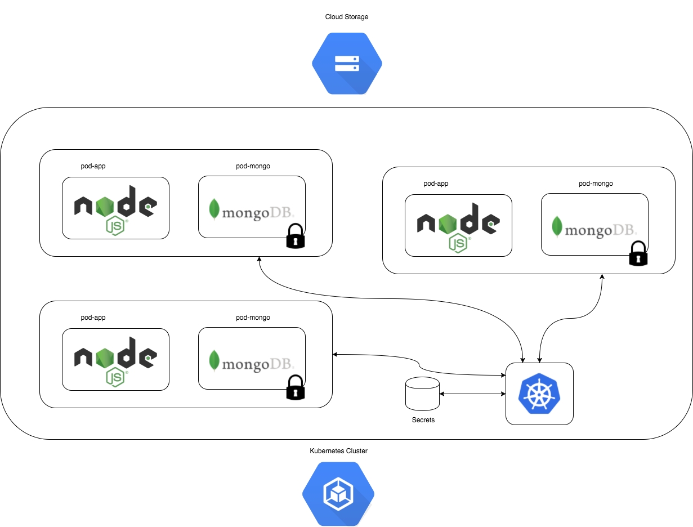

# Deplopy an application in Kubernetes with GKE



First of all, let´s create a new cluster on [GKE].

```
gcloud container clusters create your-cluster --scopes=https://www.googleapis.com/auth/devstorage.read_write
```

Set up kubctl context
```
gcloud container clusters get-credentials  your-cluster
```

## 1. Creating Secrets
In order to maintain the credentials safe we are going to create a [secret](https://kubernetes.io/docs/concepts/configuration/secret/) with all credentials related to the database.

```
$ kubectl create -f ./k8s/db-secrets.yml
secret "mongo" created
$ kubectl describe secret mongo
Name:           mongo
Namespace:      default
Labels:         <none>
Annotations:    <none>

Type:   Opaque

Data
====
database:       5 bytes
password:       3 bytes
username:       3 bytes
```

Now we create another [secret](https://kubernetes.io/docs/concepts/configuration/secret/) with all credentials related to the [Cloud Storage] bucket.

```
$ kubectl create secret generic storage-auth-credentials --from-file=credentials=path/to/json
secret "storage-auth-credentials" created
$ kubectl describe secret storage-auth-credentials
Name:           storage-auth-credentials
Namespace:      default
Labels:         <none>
Annotations:    <none>

Type:   Opaque

Data
====
credentials:    2332 bytes
```


## 2 Creating deployments and services

Now it´s time to create the [deployments] an [services] from our application using the ``.yaml`` files under the ``/k8s`` folder.

```
$ kubectl create -f ./k8s/k8s-mongo.yaml
service "mongo" created
deployment "mongo" created
$ kubectl create -f ./k8s/k8s-app.yaml
service "app" created
deployment "app" created
$ kubectl get pods
NAME                     READY     STATUS              RESTARTS   AGE
app-1343682521-225wh     0/1       ContainerCreating   0          3s
mongo-4010256831-hhc86   1/1       Running             0          2m
$ kubectl get svc
NAME         CLUSTER-IP   EXTERNAL-IP   PORT(S)        AGE
app          10.0.0.33      XXXX        80:30317/TCP   1m
kubernetes   10.0.0.1     <none>        443/TCP        11d
mongo        10.0.0.240   <none>        27017/TCP      3m
```

In this case, because it´s deployed in [GKE], and we have the Service port.type to ``LoadBalancer``
our application will be in the ``app`` service with the ``EXTERNAL-IP`` field.


## 3 Scaling our application

```
$ kubectl scale --replicas=5 deploy/app
```

[deployments]:https://kubernetes.io/docs/concepts/workloads/controllers/deployment/
[services]:https://kubernetes.io/docs/concepts/configuration/secret/
[minkube]:https://kubernetes.io/docs/getting-started-guides/minikube/


[GKE]:https://cloud.google.com/container-engine/